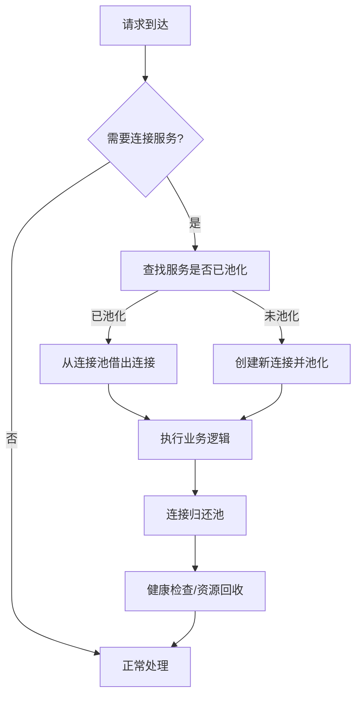

# AopPoolBundle 工作流程（Mermaid）

## 说明

- 所有通过 `#[ConnectionPool]` 注解、`snc_redis.client` 标签、`doctrine.dbal.*_connection` 服务都会自动池化。
- 连接借出和归还由 AOP 拦截自动完成。
- 池管理器与生命周期处理器共同确保资源高效复用与健康。
- 支持定时清理与健康检查，防止连接泄漏。
